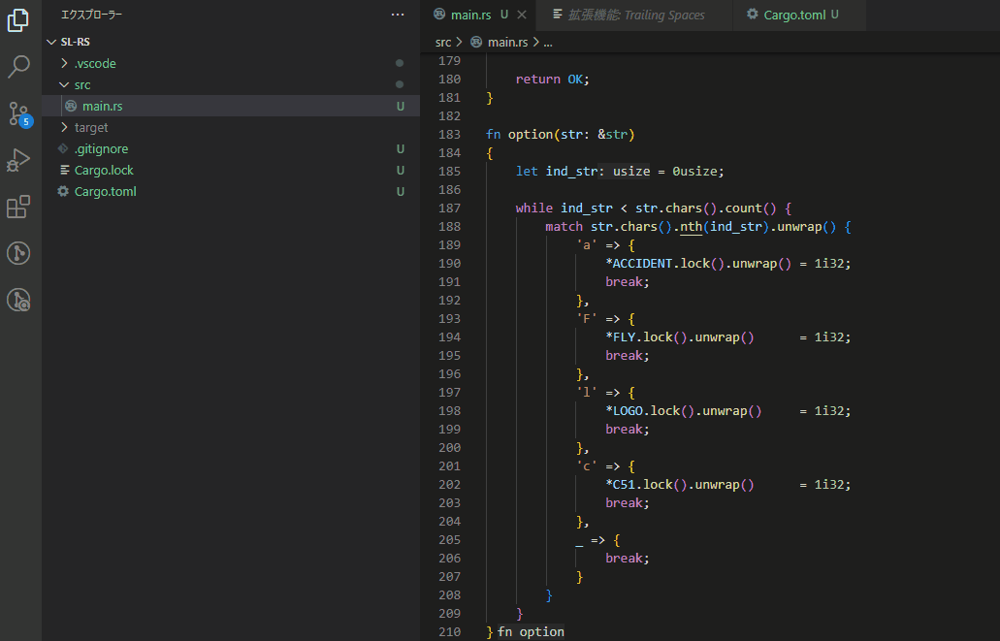

# sl-rs
Rust porting of sl (https://github.com/mtoyoda/sl) command.
You can use any options (-a / -F / -l / -c) that the original software uses.

THE AUTHOR DISCLAIMS ANY RESPONSIBILITY WITH REGARD TO THIS SOFTWARE.

## how to use

1. Clone the source code

2. run
```
cargo run -- -a
```


